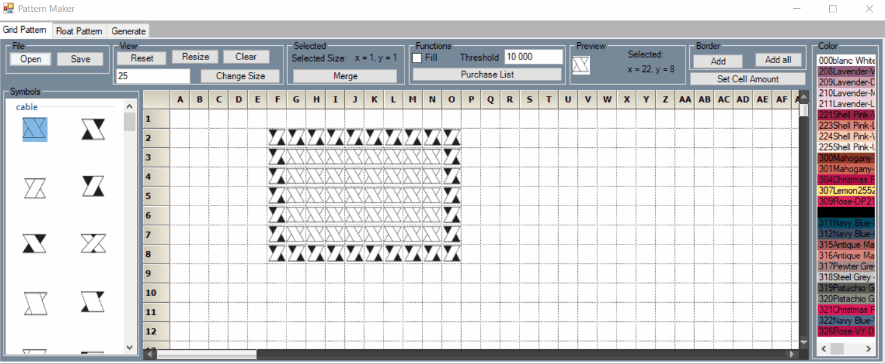
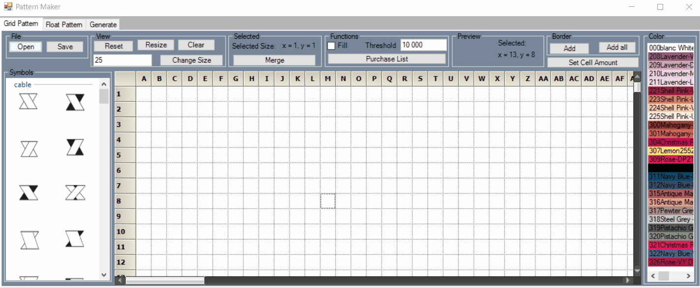
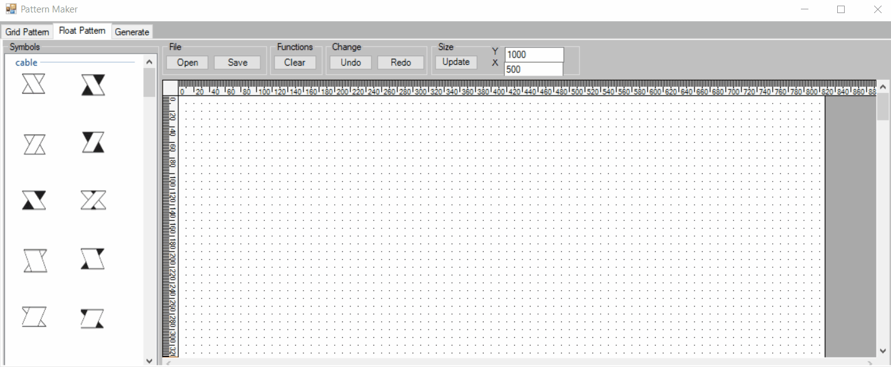
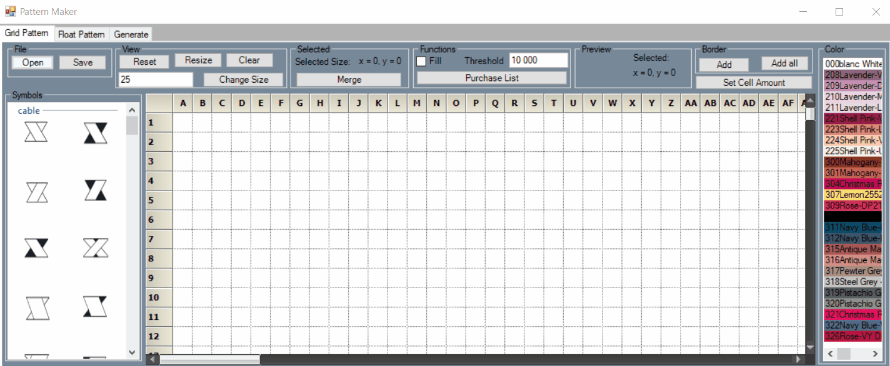

<p align="center">
  
</p>

Patterns maker is a `windows form` application with the main purpose to simplify and manage the creation of crochet, knitting, embroidery, stitching patterns. Patterns maker lets the user create patterns in either a gridcontrol or in a flowchart. The implementation is written in `C#` Visual Studio.




# Syncfusion

To simplify the implementation of a gridcontrol and flowchart i chose to use licensed nuget packages from Syncfusion.

Syncfusion was founded in 2001 and headquartered in Research Triangle Park, N.C., Syncfusion has more than 13,000 customers and more than 1 million users, including large financial institutions, Fortune 500 companies, and global IT consultancies.

Today they provide 800+ controls and frameworks for web, mobile, and desktop development. We provide ready-to-deploy enterprise software for dashboards, reports, data integration and big data processing. Many customers have saved millions in licensing fees by deploying our software.

# How-To

This part explains how to start, install and use this program.

## Install

Clone or download this repo:

```
git clone git@github.com:grebtsew/Patterns-Maker.git
```

## Develop

To open and change code install `Visual Studio 2019`, and load the project `.sln` file. This is also tested on `Visual Studio 2022`, however with some difficulties. The nuget-packages are getting depricated.

## Start

Load the project file in `Visual Studio 2019` and run the program.
An executable can also be downloaded from latest release without any installation.

## GridControl

All colors in the gridcontrol view are dmc colors for embroidery.

See GridControl demo below:


## FlowChart

See FlowChart demo below:


## Generator

See Generator demo below:


# Know Issues

This is a list of know issues which will be handled when I have time. Please let me know if you find any issues or need more functions within the implementation.

- `Windows Forms` are an outdated technology and my plan is to implement the same program in `mvc` application.
- Everything in this program is single threaded, which means the program will freeze when you run a function. This could be easily fixed with multithreading and delegate functions.
- The code is currently a mess due to speedy development for demo. Code should be seperated into seperate files and renamed.

# License

This project utilizes the 
